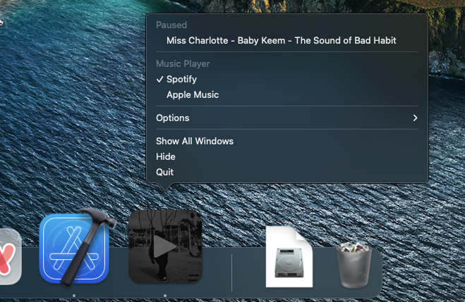

# Groove.app

Display live track info from Spotify and Apple Music in your dock.

Using NSDockTile and SwiftUI, Groove interfaces with Spotify and
Apple Music to control and display track info.

https://user-images.githubusercontent.com/7284672/199579997-f417812a-1f0f-47db-b6d5-80252d60abe9.mov

## Usage

Clicking on the Groove dock icon will toggle play/pause status.

Double clicking will advance to the next track.

## Download

Latest Groove DMG can found [here](https://github.com/woofers/groove/releases).

## Configuration

To choose which music player to use,
right click on the Groove dock tile
and switch between Apple Music and Spotify.

## Libraries

Groove makes use of the following libraries:

- [DSFDockTile](https://github.com/dagronf/DSFDockTile) Allows a NSViewController to be used in the DockTile.
- [MusicPlayer](https://github.com/ddddxxx/MusicPlayer) Communicates with Spotify and Apple Music client apps to control playback and obtain track info
